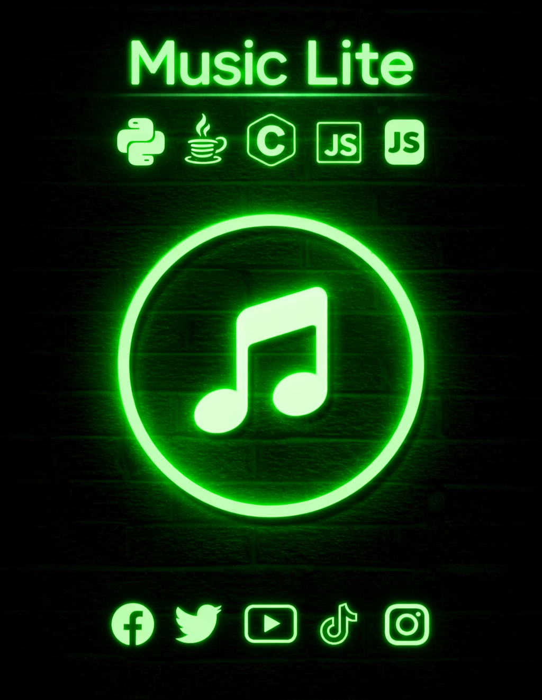

> <b>🚀 Versión actual: 1.0</b>

 

 
</a>
 
</a>    
 
</a>
  
<h3 align="left">🛠 Language and tools</h3>

###

  
  
  
  
  
  
  
  
  
  
  
  
  

# 🧠 TECH STACK

---

# 📊 SYSTEM ANALYTICS

---
